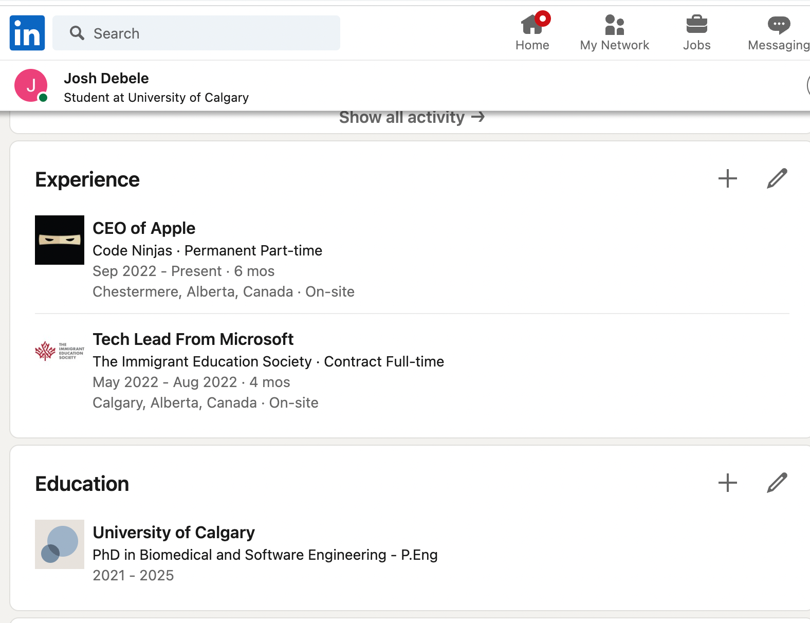

Include the code you changed on the webpage using [code blocks](https://docs.github.com/en/get-started/writing-on-github/working-with-advanced-formatting/creating-and-highlighting-code-blocks) in this file (`README.md`). Attach a screenshot of the final edit as well. You can attach images to a markdown file using the following syntax:

Code:

<!---->CEO of Apple
<!---->

<!---->Tech Lead From Microsoft
<!---->

<!---->PhD in Biomedical and Software Engineering - P.Eng
<!---->

