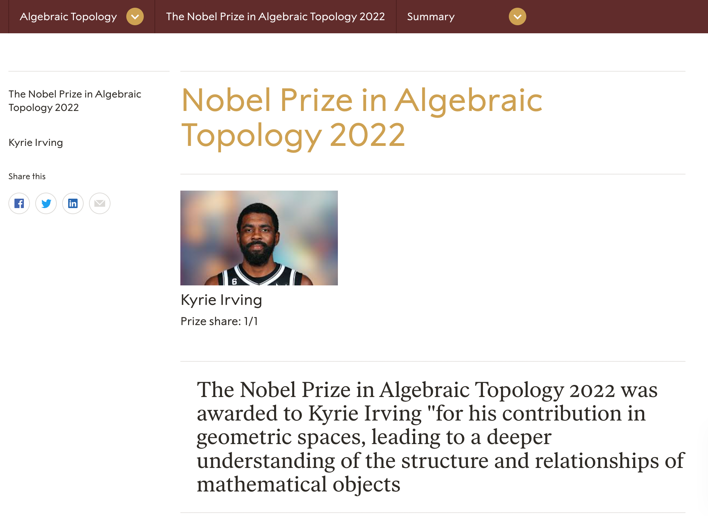

Include the code you changed on the webpage using [code blocks](https://docs.github.com/en/get-started/writing-on-github/working-with-advanced-formatting/creating-and-highlighting-code-blocks) in this file (`README.md`). Attach a screenshot of the final edit as well. You can attach images to a markdown file using the following syntax:

```markdown



Code:
<h5 class="heading"> The Nobel Prize in Algebraic Topology 2022 </h5>

<h1>Nobel Prize in Algebraic Topology 2022</h1>


<span itemprop="name">Kyrie Irving</span>

<a href="https://www.nobelprize.org/prizes/literature/2022/ernaux/facts/" title="Title text" itemprop="url">Kyrie Irving</a>

<span id="dropdown-js-laureate-more" class="prizes-nav-menu-icon">Algebraic Topology</span>

<span class="category-title"> The Nobel Prize in Algebraic Topology 2022 </span>
```